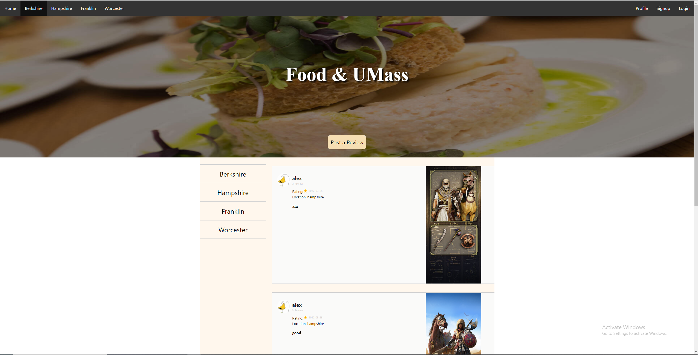
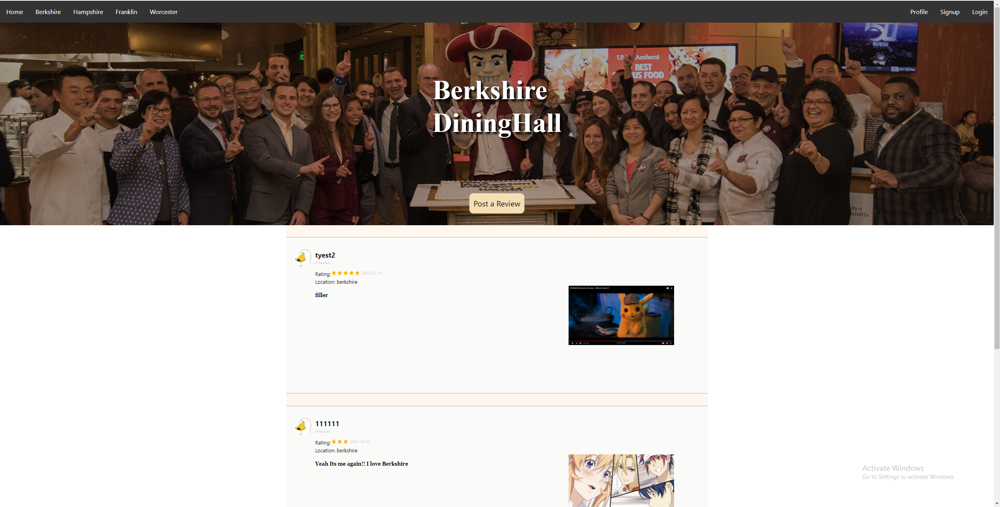
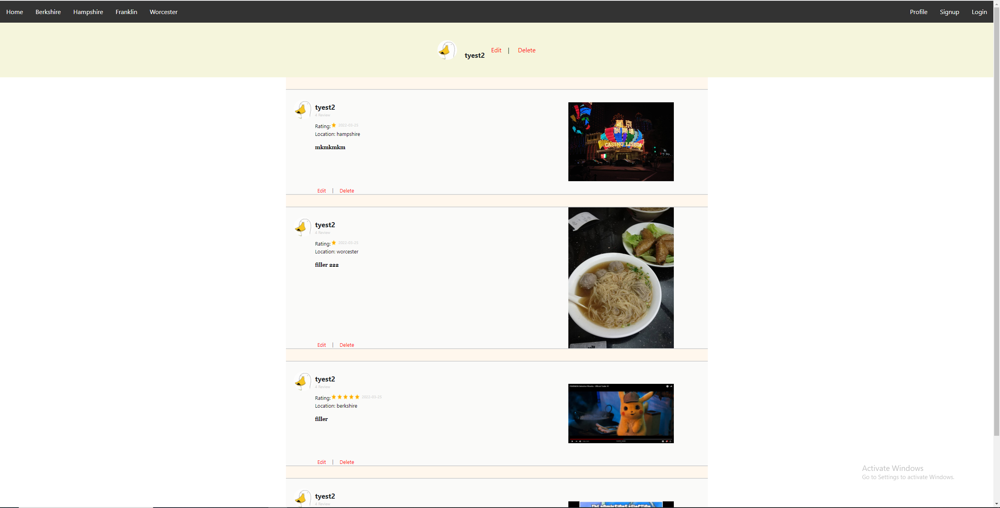

# Title
Team YYDS

# Subtitle
Food and UMass

# Semester
Spring 2022

# Overview
Food & UMass is a website that students could share their thoughts on the food at dining halls everyday. Users can score the food, leave comments, add pictures, and tag the dining hall location. Based on their peer's ratings, students could choose the best dining common to go each day. Currently we have Yelp on the market as a competitor but our website will be UMass oriented and tailored to the campus dining commons for students.

# Team Members:
Chaolong Tang (alextangchao) \
RuiLong Jiang (AMOOOMA) \
Xuming Deng (Silvennnn) \
Hongwei Shu ()


# User Interface //TODO Upload Image
- Home 
    - Home is the first page when user enter our website. It will list a few latest reviews from each dining hall. Also, it contians the navigation bar to help user navigate our website.


- Dining Hall Pages
    - Each page contain the reviews for specific dining hall and reviews are sorted by date (Latest First)
        - Berkshire
        - Hampshire
        - Franklin
        - Worcester


- Post Review
    -  Page where user could create and post their review for each dining hall.


- Sign up
    - Page where user could create an account


- Login
    - Page where user could login to our website.


- User Home
    - Page where user could manage(edit/delete) all their posted reviews.


# APIs

## User API
/users - a view endpoint that returns all of the existing users \
/user/login - which allow users to login \
/user/register - which allow users to register \
/user?id= - a view endpoint which return the user's information by uuid \
/user/update - which allow users to update personal information such as pfp, name, password \
/user/delete - which allow users to delete their account and reviews accordingly

## Review API
/review/location?name= - which returns all of the reviews of a specific dining hall \
/review/create - which allow users to create a review \
/review?id= - a view endpoint which return a specific review base on review id \
/review/userid - which return all the reviews post by the user with userid \
/review/update - which allow users to update their review \
/review/delete - which allow users to delete their review 


## Image API
/image?id= - which allow client to get the image from server by id \
/image/create - which allow client to upload the image \
/image/delete - which allow client to delete the image 


# Database
#### user document
```
{
	_id: <ObjectId1>,
	username: String,  // The username of the user
	password: String,  // The sha256 encrypted password of the user
}
```

#### review document
```
{
	_id: <ObjectId1>,
	user_id: String,  // User id for referencing user data
	rating: Integer,  // User rating
	location: String, // Dining hall location
	review_text: String, // User review
	visited_date: String, // Visited date submitted by the user, YYYY-MM-DD
	review_img_id: String[Optional] // Uploaded image id
}
```

### image GridFS
#### image.files
```
{
	_id: <ObjectId1>,
    	length: Integer, // file length
    	chunkSize: Integer, // chunk count in image.chunks
    	uploadDate: Date, // image uploaded date
	filename: String,  // filename of the image
	contentType: String,  // image type
}
```

#### image.chunks
```
{
	_id: <ObjectId1>,
    	files_id: <ObjectId2>, // Reference id for image.files 
	n: Integer,  // Sequence number of the chunk
	data: Binary // Actual file data
}
```


# URL Routes
| URL routes        | description                                |
| ----------        | -----------                                |
| index.html        | Home page for our website              |
| berkshire.html    | Page includes all the reviews for Berkshire dining |
| hampshire.html    | Page includes all the reviews for Hampshire dining |
| franklin.html     | Page includes all the reviews for Franklin dining  |
| worcester.html    | Page includes all the reviews for Worcester dining |
| login.html        | Page where users can login          |
| signup.html       | Page where users can sign up                 |
| user-home.html    | Page where users can view all reviews post by themselves (need login)       |
| edit-review.html  | Page where users edit their review (need login)         |          |
| edit-user.html    | Page where users edit personal information (need login)         |          |

# Authentication
Authentication is done using passport's local strategy for login and password is encrypted using sha256 on the backend and stored in db collection user. Persistent login and crediential verification is done with issuing jwt token with expiration date and is encrypted with salt set by the environmental variable. All secure routes, such as /user/delete, are protected using passport's jwt strategy.

# Division of Labor
### RuiLong Jiang
- Server/database setup
    - express server and env file
    - database connection
- Authentication
    - passport js local strategy
    - jwt token signing
    - example secure route GET /users with jwt strategy
- Implemented end-points
    - POST /user/login
    - POST /user/register
    - /user/(update/delete) (skeleton with faker)
    - /review/(update/delete) (skeleton with faker)
- Implemented frontend html/js
    - home/index.html - nav bar / banner image
    - edit-user.html
    - user_crud.js on user/review update/delete
    - post review image upload js

### Chaolong Tang
- Design the UI of all Dining Hall and User Home Page
- Implement frontend html and js
    - user home page
    - edit user review page
- Implement frontend fetch image function
    - Upload image
    - Get image by id
    - Delete image by id
- Implement back-end Image end-points and database crud functions
    - Add image
    - Get image by id
    - Delete image by id
- Config backend server CORS setting.
- Add Heroku config and deploy project on Heroku.

### Xuming Deng
Assigned: Review Parts
- Implemented end-points for reviews. 
    - /review/location?name=
    - /review/create
    - /review?id=
- Implemented database function for reviews.
    - addReview
    - deleteReview
    - getReview
    - getReviewByLocation
    - getReviewByUserID
- Front-end UI design for reviews.
- Implemented DiningHall.js
    - Fetching all the reviews from the server (For specific dining hall)
    - Generating review and render on each dining hall page

### Hongwei Shu
- Implemented end-points for user.
  - user/register
  - user/update
  - user/delete
- Implemented the navigation bar after login
- Implemented login/signup html and js part
- Image part with user information
- Front-end design for login/signup/edit user
- Implemented edit_user for edit user profile
- Updated user profile edit (HTML) and delete(request in js)


# Conclusion
### Xuming Deng
This is my first time building a website. It was a really valuable expeirence for me. I learned a lot about how to UI design and back-end implementation, such as configuring server and database. I do encountered many difficulties, but thanks to my teammates, they gave me lots of idea and fix all those problems.

### Chaolong Tang
This is my first time writing front-end html, css, and js code. I learned a lot on UI design and using css to style the html components. I also learned the mechanism and technique to send image through HTTP request and store in MongoDB.

### Hongwei Shu
I am an Informatics major student. This is actually the first time writing a project about website. I believe this course taught me a lot about web programming. I learned how to build a website in detailed. There are many difficulties such as writing backend and deploy the website. Thanks to my teammates and TAs, they help me a lot when solving these problems.

### RuiLong Jiang
Overall good, no significant challenges met during development and it's nice to learn/practice about frontend development with html/js. Also great to explore mongodb for its easy to use query and insertion compared to postgresql. One thing I would say that I wish I'd have know is a recommended file/functions hiearchy/structure because we winged it and rolled with punches for this project. Not sure if there's a better way to do this.


