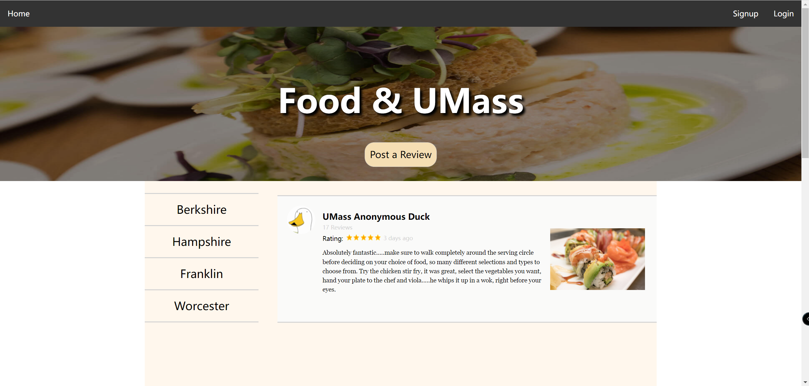

# Team Name
27-yyds

# Data Interactions
User can post review for one of the four dining hall.

User can also view all the reviews posted from other users.

User need to login before posting review, but user can view all reviews without login.

For each review, user can:
- Tag one dining common
- Score the food
- Leave comment
- Add picture

# Wireframes, Mockups, and Division of Work
## Landing Page / Home
#### Assigned: RuiLong Jiang
This is home.html, the landing page of the website that includes some top trending reviews and the button link to each dining hall page.

This is the wireframe for Landing Page / Home Page:

This is the screenshot for Landing Page / Home Page:

## Dining Hall Page
#### Assigned: Chaolong Tang
This here is the detailed view of each dining halls, a place to view a complete list of reviews sorted by time.

This is the wireframe for Dining Hall Page:

This is the screenshot for Dining Hall Page:

## Review
#### Assigned: Xuming Deng
<!-- This is a subsection of the other pages, basically the review item with ratings photos and review text. -->

This is the detail of a review. A review has a title, the rating for food, detail description, and a picture. This review part works as a subsection of the other pages.

This is the wireframe for Review:

This is the screenshot for Review:

## Post Review
#### Assigned: Xuming Deng
This is the part where user post review.

This is the screenshot for Post Review Page:

## Login / Signup
#### Assigned: Hongwei shu
This is the login and signup page for user to enroll instead of browsing as guest. (Posting should be limited to members)

This is the wireframe for Login / Signup Page:

This is the screenshot for Login / Signup Page:

