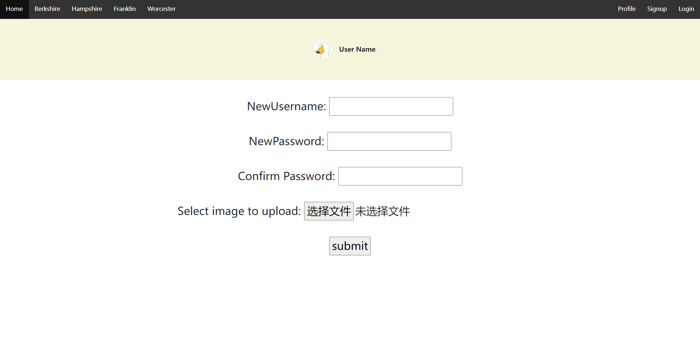

# Team Name
CS326-27-yyds

# API Endpoint & Description:

## User API
/user/login - which allow users to login \
/user/register - which allow users to register \
/user?id= - a view endpoint which return the user's information by uuid \
/user/reviews?id - which return all the reviews post by a user by user uuid \
/user/update - which allow users to update personal information such as pfp, name, password \
/user/delete - which allow users to delete their account and reviews accordingly

## Review API
/review/location?name= - which returns all of the reviews of a specific dining hall \
/review/create - which allow users to create a review \
/review?id= - a view endpoint which return a specific review base on review id \
/review/update - which allow users to update their review \
/review/delete - which allow users to delete their review 

## Image API
/image?id= - which allow client to get the image from server by id \
/image/create - which allow client to upload the image \
/image/delete - which allow client to delete the image 

# Client Interface:
This is where we GET the list of reviews for a specific dining halls and retrieve review imgs accordingly

This is where we can POST a new review into the database

This is where we can PUT or DELETE a review

Here is the login page to send a POST request to verify the user credentials

Here is the signup page where we can send a POST request to add a new user

Here is the edit user page where user will be able to make changes to their account

# Heroku Application URL:
https://cs326-food-and-umass.herokuapp.com

# Division of Labor:
### RuiLong Jiang
- Init express server and serve static client files. 
- Setup backend endpoint user/update, delete, review/update, delete with const faker_review and faker_user. 
- Frontend crud js for sending the corresponding PUT/DELETE request. 
- Post review page's frontend js for review form submission with image. 
- Add edit-user.html for user to make changes to account details.
### Chaolong Tang
- Created backend API end-points for the image parts, including get image by id, upload image and delete image by id.
- Config backend CORS setting.
- Create frontend js function on fetching image, including upload, get, and delete image.
- Create user's home page for showing all the reviews post by this user. Also support user to edit and delete its reviews.
- Create Edit Review Page for user to edit its review.
- Deploy project on Heroku.
### Xuming Deng
Assigned: review/location, create, get
- Created end-points for review/location, review/create, review/id
- Created Fake Reviews
- Created Dining Hall Page for (Hampshire, Berkshire, Franklin, Worcester)
- Implemented DiningHall.js
    - Fetching all the reviews from the server (For specific dining hall)
    - Generating review and render on each dining hall page
- Update CSS files and HTML for review component.

### Hongwei Shu
user/loign, register, get
